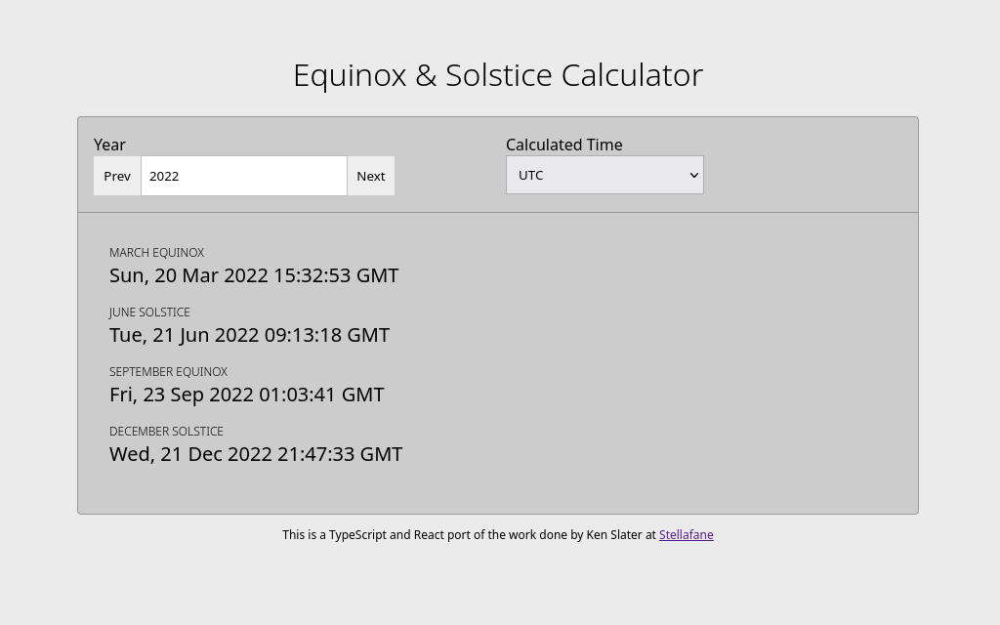

# React Equinox & Solstice Calculator

> Calculate solstice and equinox dates for a given year.



## Table of Contents

- [1. Getting Started](#1-getting-started)
  - [1.1 Prerequisites](#1.1-prerequisites)
  - [1.2 Installing](#1.2-installing-and-running-locally)
- [2. Contributing](#2-contributing)
- [3. Testing](#3-testing)
- [4. Built With](#4-built-with)
- [5. Credits and Community](#5-credits-and-community)
- [6. License](#6-license)

## 1. Getting Started

These instructions will get you a copy of the project up and running on your local machine for development and testing purposes.

### 1.1 Prerequisites

You'll need Node installed on your machine, the best way to install/manage
Node versions is to use Volta.

- [Volta](https://github.com/volta-cli/volta) - the Hassle-Free JavaScript
  Tool Manager

```
$ curl https://get.volta.sh | bash
```

Once Volta is installed, install Node (pinned to `lts` on package.json)

```
$ volta install node
```

### 1.2 Installing and Running Locally

```
$ npm install
```

Now you can start the development server by running the command below:

```
$ npm run dev
```

The application will be available at [http://localhost:3000](http://localhost:3000)

## 2. Contributing

To contribute features or bug fixes:

1. create a new branch off the `master` branch with the name of your feature or
   bug fix (e.g. `chore/update_dependency` branch);

2. once you're finished with your changes open a pull request from your 
   branch to `master`.

We use [commitlint](https://github.com/conventional-changelog/commitlint) to 
enforce commits that follow the [Conventional Commits specification](https://www.conventionalcommits.org/en/v1.0.0/#summary).

The most common and useful types are `chore`, `docs`, `feat`, `fix`, 
`refactor` and `test`. Examples of valid commit messages would be:

```
$ git commit -m "docs: updated README"
```

or

```
$ git commit -m "feat: added Profile component"
```

## 3. Testing

Unit and integration tests use Jest, you can run the interactive test monitor with the following command:

```
$ npm test
```

You can read more about testing here:

- [Write tests. Not too many. Mostly integration.](https://kentcdodds.com/blog/write-tests)

- [Static Type Checking](https://reactjs.org/docs/static-type-checking.html#typescript)

## 4. Built With

- [axios](https://github.com/axios/axios) - Promise based HTTP client for
  the browser and node.js.

- [commitlint](https://github.com/conventional-changelog/commitlint) - checks if your commit messages meet the conventional commit format.

- [eslint](https://github.com/eslint/eslint) - find and fix problems in your
  JavaScript code.

- [husky](https://github.com/typicode/husky) - git hooks made easy.

- [jest](https://github.com/facebook/jest) - delightful JavaScript testing.

- [lint-staged](https://github.com/okonet/lint-staged) - run linters on git
  staged files.

- [prettier](https://github.com/prettier/prettier) - an opinionated code formatter.

- [react](https://github.com/facebook/react) - a declarative, efficient, and
  flexible JavaScript library for building user interfaces.

- [react-helmet-async](https://github.com/staylor/react-helmet-async) -
  thread-safe Helmet for React 16+ and friends.

- [react-router](https://github.com/ReactTraining/react-router/) -
  declarative routing for React.

- [react-testing-library](https://github.com/testing-library/react-testing-library) -
  simple and complete React DOM testing utilities that encourage good testing
  practices.

- [Sass](https://github.com/sass/sass) - an extension of CSS, adding nested
  rules, variables, mixins, selector inheritance, and more.

- [TypeScript](https://www.typescriptlang.org/) - a strongly typed programming language that builds on JavaScript, giving you better tooling at any scale.

- [Vite](https://github.com/vitejs/vite) - next generation frontend tooling.

## 5. Credits and Community

This project exists thanks to all the <a href="https://github.
com/rlueder/equinox-solstice-calc/graphs/contributors">people who 
contribute</a>.

- [Rafael Lüder](https://github.com/rlueder)

## 6. License

This project is licensed under the MIT License - see the [LICENSE](LICENSE) file for details.
